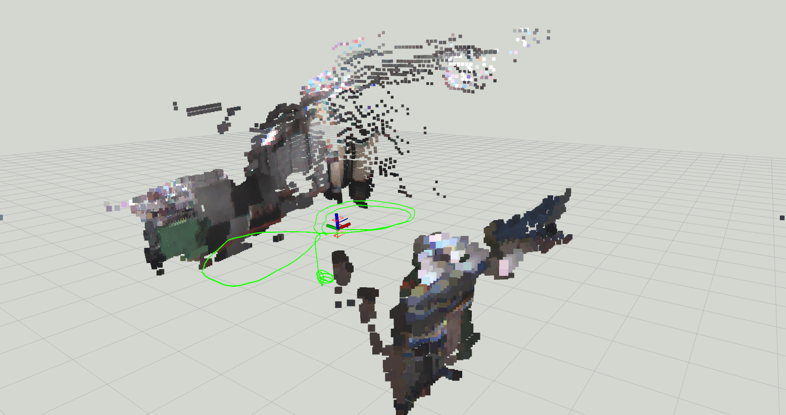
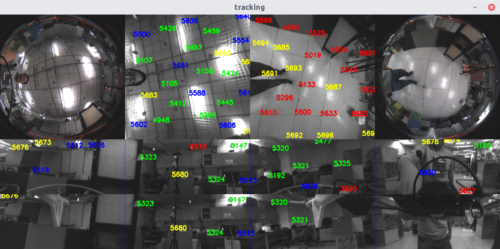
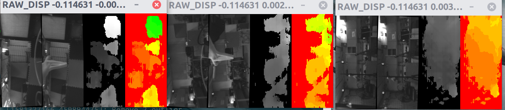

# VINS-Fusion-Fisheye
This repository is a version of VINS-Fusion with Dual Fisheye and GPU and Visionworks acceleration. It can run on Nvidia TX2 in real-time, also provide depth estimation based on fisheye.


*Drone path and RGB point cloud estimation*



*Feature tracker for fisheye*



*Disparity estimation for depth estimation*

## 1. Prerequisites  
The essential software environment is same as VINS-Fusion. Besides, it requires OpenCV cuda version.(Only test it on OpenCV 3.4.1).
Visionworks: Optional

If you want to CUDA mode of this package, [libSGM](https://github.com/fixstars/libSGM) is required for depth estimation.

## 2. Usage
### 2.1 Change the opencv path in the CMakeLists
This package support CUDA mode and CPU mode with OpenMP enabled. If you are using on embedded device, I strongly recommend you to use this package with CUDA to achieve best performance.

By default, CUDA is automatically detected, however you can disable it by set

>set(DETECT_CUDA false)

When using OpenCV, I recommend that you to compile and install opencv 3.4 with CUDA to /usr/local/

If your opencv with CUDA is installed in other localization, modify the

>SET("OpenCV_DIR"  "/usr/local/share/OpenCV/")

If you don't have visionworks, please 
>set(ENABLE_VWORKS false)

NVIDIA VisionWorks gives slightly better performance, however, the VisionWorks support for this package is not stable yet.

### Fisheye usage
Term 0
>roscore

Term 1
>rosrun vins vins_node ~/your_ws/src/VINS-Fusion-Fisheye/config/fisheye_ptgrey_n3/fisheye.yaml

Term 2
>rosbag play fishey_vins_2020-01-30-10-38-14.bag --clock -s 12

Term 3(for visuallization only)
>roslaunch vins vins_rviz.launch

For rosbag, you can download from https://www.dropbox.com/s/kmakksca3ns6cav/fisheye_vins_2020-01-30-10-38-14.bag?dl=0
### Parameters for fisheye
```yaml
depth_config: "depth_cpu.yaml" # config path for depth estimation, depth_cpu.yaml uses opencv SGBM, depth.yaml uses visionworks SGM, you must install visionworks before use visionworks sgm
image_width: 600 # For fisheye, this indicate the flattened image width; min 100; 300 - 500 is good for vins
fisheye_fov: 235 # Your fisheye fov
enable_up_top: 1 #Choose direction you use
enable_down_top: 1
enable_up_side: 1
enable_down_side: 1
enable_rear_side: 1
thres_outlier : 5.0 # outlier thres for backend
tri_max_err: 3.0 #outlier thres for triangulate

depth_estimate_baseline: 0.05 # mini baseline for pts initialization
top_cnt: 30 #number of track point for top view
side_cnt: 30 #number of track point for side view
max_solve_cnt: 30 # Max Point for solve; highly influence performace
show_track: 0 # if display track
use_vxworks: 0 #use vision works for front-end; not as stable as CUDA now

enable_depth: 1 # If estimate depth cloud; only available for dual fisheye now
rgb_depth_cloud: 0 # -1: point no texture,  0 depth cloud will be gray, 1 depth cloud will be colored;
#Note that textured and colored depth cloud will slow down whole system
```
Parameter for depth estimation

```yaml;
#choose the depth you want estimate
enable_front: 1
enable_left: 1
enable_right: 1
enable_rear: 0
#downsample ration
downsample_ratio: 0.5
#choose use cpu or visionworks
use_vworks: 0

#Publish cloud jump step
pub_cloud_step: 1
#If show dispartity
show_disparity: 0
#If publish depth map image
pub_depth_map: 1
#Publish cloud in radius
depth_cloud_radius: 10
#If publish all depth cloud in a topic
pub_cloud_all: 1
#If publish all depth cloud in every direction
pub_cloud_per_direction: 0

```
# VINS-Fusion
## An optimization-based multi-sensor state estimator


VINS-Fusion is an optimization-based multi-sensor state estimator, which achieves accurate self-localization for autonomous applications (drones, cars, and AR/VR). VINS-Fusion is an extension of [VINS-Mono](https://github.com/HKUST-Aerial-Robotics/VINS-Mono), which supports multiple visual-inertial sensor types (mono camera + IMU, stereo cameras + IMU, even stereo cameras only). We also show a toy example of fusing VINS with GPS. 
**Features:**
- multiple sensors support (stereo cameras / mono camera+IMU / stereo cameras+IMU)
- online spatial calibration (transformation between camera and IMU)
- online temporal calibration (time offset between camera and IMU)
- visual loop closure


We are the **top** open-sourced stereo algorithm on [KITTI Odometry Benchmark](http://www.cvlibs.net/datasets/kitti/eval_odometry.php) (12.Jan.2019).

**Authors:** [Tong Qin](http://www.qintonguav.com), Shaozu Cao, Jie Pan, [Peiliang Li](https://peiliangli.github.io/), and [Shaojie Shen](http://www.ece.ust.hk/ece.php/profile/facultydetail/eeshaojie) from the [Aerial Robotics Group](http://uav.ust.hk/), [HKUST](https://www.ust.hk/)

**Videos:**

<a href="https://www.youtube.com/embed/1qye82aW7nI" target="_blank"></a>


**Related Papers:** (papers are not exactly same with code)
* **A General Optimization-based Framework for Local Odometry Estimation with Multiple Sensors**, Tong Qin, Jie Pan, Shaozu Cao, Shaojie Shen, aiXiv [pdf](https://arxiv.org/abs/1901.03638) 

* **A General Optimization-based Framework for Global Pose Estimation with Multiple Sensors**, Tong Qin, Shaozu Cao, Jie Pan, Shaojie Shen, aiXiv [pdf](https://arxiv.org/abs/1901.03642) 

* **Online Temporal Calibration for Monocular Visual-Inertial Systems**, Tong Qin, Shaojie Shen, IEEE/RSJ International Conference on Intelligent Robots and Systems (IROS, 2018), **best student paper award** [pdf](https://ieeexplore.ieee.org/abstract/document/8593603)

* **VINS-Mono: A Robust and Versatile Monocular Visual-Inertial State Estimator**, Tong Qin, Peiliang Li, Shaojie Shen, IEEE Transactions on Robotics [pdf](https://ieeexplore.ieee.org/document/8421746/?arnumber=8421746&source=authoralert) 


*If you use VINS-Fusion for your academic research, please cite our related papers. [bib](https://github.com/HKUST-Aerial-Robotics/VINS-Fusion/blob/master/support_files/paper_bib.txt)*

## 1. Prerequisites
### 1.1 **Ubuntu** and **ROS**
Ubuntu 64-bit 16.04 or 18.04.
ROS Kinetic or Melodic. [ROS Installation](http://wiki.ros.org/ROS/Installation)


### 1.2. **Ceres Solver**
Follow [Ceres Installation](http://ceres-solver.org/installation.html).


## 2. Build VINS-Fusion
Clone the repository and catkin_make:
```
    cd ~/catkin_ws/src
    git clone https://github.com/HKUST-Aerial-Robotics/VINS-Fusion.git
    cd ../
    catkin_make
    source ~/catkin_ws/devel/setup.bash
```
(if you fail in this step, try to find another computer with clean system or reinstall Ubuntu and ROS)

## 3. EuRoC Example
Download [EuRoC MAV Dataset](http://projects.asl.ethz.ch/datasets/doku.php?id=kmavvisualinertialdatasets) to YOUR_DATASET_FOLDER. Take MH_01 for example, you can run VINS-Fusion with three sensor types (monocular camera + IMU, stereo cameras + IMU and stereo cameras). 
Open four terminals, run vins odometry, visual loop closure(optional), rviz and play the bag file respectively. 
Green path is VIO odometry; red path is odometry under visual loop closure.

### 3.1 Monocualr camera + IMU

```
    roslaunch vins vins_rviz.launch
    rosrun vins vins_node ~/catkin_ws/src/VINS-Fusion/config/euroc/euroc_mono_imu_config.yaml 
    (optional) rosrun loop_fusion loop_fusion_node ~/catkin_ws/src/VINS-Fusion/config/euroc/euroc_mono_imu_config.yaml 
    rosbag play YOUR_DATASET_FOLDER/MH_01_easy.bag
```

### 3.2 Stereo cameras + IMU

```
    roslaunch vins vins_rviz.launch
    rosrun vins vins_node ~/catkin_ws/src/VINS-Fusion/config/euroc/euroc_stereo_imu_config.yaml 
    (optional) rosrun loop_fusion loop_fusion_node ~/catkin_ws/src/VINS-Fusion/config/euroc/euroc_stereo_imu_config.yaml 
    rosbag play YOUR_DATASET_FOLDER/MH_01_easy.bag
```

### 3.3 Stereo cameras

```
    roslaunch vins vins_rviz.launch
    rosrun vins vins_node ~/catkin_ws/src/VINS-Fusion/config/euroc/euroc_stereo_config.yaml 
    (optional) rosrun loop_fusion loop_fusion_node ~/catkin_ws/src/VINS-Fusion/config/euroc/euroc_stereo_config.yaml 
    rosbag play YOUR_DATASET_FOLDER/MH_01_easy.bag
```


## 4. KITTI Example
### 4.1 KITTI Odometry (Stereo)
Download [KITTI Odometry dataset](http://www.cvlibs.net/datasets/kitti/eval_odometry.php) to YOUR_DATASET_FOLDER. Take sequences 00 for example,
Open two terminals, run vins and rviz respectively. 
(We evaluated odometry on KITTI benchmark without loop closure funtion)
```
    roslaunch vins vins_rviz.launch
    (optional) rosrun loop_fusion loop_fusion_node ~/catkin_ws/src/VINS-Fusion/config/kitti_odom/kitti_config00-02.yaml
    rosrun vins kitti_odom_test ~/catkin_ws/src/VINS-Fusion/config/kitti_odom/kitti_config00-02.yaml YOUR_DATASET_FOLDER/sequences/00/ 
```
### 4.2 KITTI GPS Fusion (Stereo + GPS)
Download [KITTI raw dataset](http://www.cvlibs.net/datasets/kitti/raw_data.php) to YOUR_DATASET_FOLDER. Take [2011_10_03_drive_0027_synced](https://s3.eu-central-1.amazonaws.com/avg-kitti/raw_data/2011_10_03_drive_0027/2011_10_03_drive_0027_sync.zip) for example.
Open three terminals, run vins, global fusion and rviz respectively. 
Green path is VIO odometry; blue path is odometry under GPS global fusion.
```
    roslaunch vins vins_rviz.launch
    rosrun vins kitti_gps_test ~/catkin_ws/src/VINS-Fusion/config/kitti_raw/kitti_10_03_config.yaml YOUR_DATASET_FOLDER/2011_10_03_drive_0027_sync/ 
    rosrun global_fusion global_fusion_node
```


## 5. VINS-Fusion on car demonstration
Download [car bag](https://drive.google.com/open?id=10t9H1u8pMGDOI6Q2w2uezEq5Ib-Z8tLz) to YOUR_DATASET_FOLDER.
Open four terminals, run vins odometry, visual loop closure(optional), rviz and play the bag file respectively. 
Green path is VIO odometry; red path is odometry under visual loop closure.
```
    roslaunch vins vins_rviz.launch
    rosrun vins vins_node ~/catkin_ws/src/VINS-Fusion/config/vi_car/vi_car.yaml 
    (optional) rosrun loop_fusion loop_fusion_node ~/catkin_ws/src/VINS-Fusion/config/vi_car/vi_car.yaml 
    rosbag play YOUR_DATASET_FOLDER/car.bag
```


## 6. Run with your devices 
VIO is not only a software algorithm, it heavily relies on hardware quality. For beginners, we recommend you to run VIO with professional equipment, which contains global shutter cameras and hardware synchronization.

### 6.1 Configuration file
Write a config file for your device. You can take config files of EuRoC and KITTI as the example. 

### 6.2 Camera calibration
VINS-Fusion support several camera models (pinhole, mei, equidistant). You can use [camera model](https://github.com/hengli/camodocal) to calibrate your cameras. We put some example data under /camera_models/calibrationdata to tell you how to calibrate.
```
cd ~/catkin_ws/src/VINS-Fusion/camera_models/camera_calib_example/
rosrun camera_models Calibrations -w 12 -h 8 -s 80 -i calibrationdata --camera-model pinhole
```


## 7. Acknowledgements
We use [ceres solver](http://ceres-solver.org/) for non-linear optimization and [DBoW2](https://github.com/dorian3d/DBoW2) for loop detection, a generic [camera model](https://github.com/hengli/camodocal) and [GeographicLib](https://geographiclib.sourceforge.io/).

## 8. License
The source code is released under [GPLv3](http://www.gnu.org/licenses/) license.

We are still working on improving the code reliability. For any technical issues, please contact Tong Qin <qintonguavATgmail.com>.

For commercial inquiries, please contact Shaojie Shen <eeshaojieATust.hk>.
